# 📐 Wiki: Arquitectura 'Diamond Tier' — TerrorMeter [v1.2.0]

Estructura técnica del motor de métricas de combate mantenido por **DarckRovert**.

## 🏗️ Jerarquía del Sistema de Métricas (Data Hierarchy)

TerrorMeter opera mediante la interceptación del registro de combate y la orquestación de red:

1.  **Hueso del Parser (`parser-vanilla.lua`)**: Escucha el evento `CHAT_MSG_COMBAT_SELF_LOG` y otros para decodificar daño y sanación.
2.  **Motor de Amenaza (`threat.lua`)**: Calcula dinámicamente los multiplicadores de agro según la clase y hechizo.
3.  **Módulo de Sincronización (`sync.lua`)**: Canal de comunicación bidireccional entre clientes del AddOn en la misma Raid/Guild.
4.  **Interface Renderer (`window.lua`)**: Dibuja las barras de métricas con perfiles de configuración dinámicos.

---

## 🧭 Diagrama de Flujo: Sincronización de Amenaza v9.4

```mermaid
graph TD
    A[Evento Combat Log: Daño/Skill] --> B[Decodificación de Daño Parser]
    B --> C[Asignación de Amenaza Threat.lua]
    C --> D{¿Cambio Significativo?}
    D -- Sí --> E[Búfer de Envío Sync.lua]
    D -- No --> Z[Esperar Siguiente Evento]
    E --> F[Inyección en Canal de Hermandad/Banda]
    F --> G[Recepción en Clientes del Séquito]
    G --> H[Render de Barras con Throttling 0.1s]
    H --> I[Sincronización con WCS_Brain PetAI]
```

## ⚡ Estrategias de Ingeniería Diamond Tier

- **Selective Parsing**: El parser solo decodifica eventos relevantes para el combate activo, ignorando el spam de buffs/debuffs menores.
- **Sync Throtling**: Los datos de amenaza se envían en paquetes comprimidos cada `50ms` para evitar la saturación del ancho de banda de red del cliente 1.12.1.
- **WCS Neural Integration**: Los informes de eficiencia de mascotas se inyectan a través de eventos personalizados para el análisis táctico.

---
© 2026 **DarckRovert** — El Séquito del Terror.
*Midiendo el camino hacia la gloria en Azeroth.*

