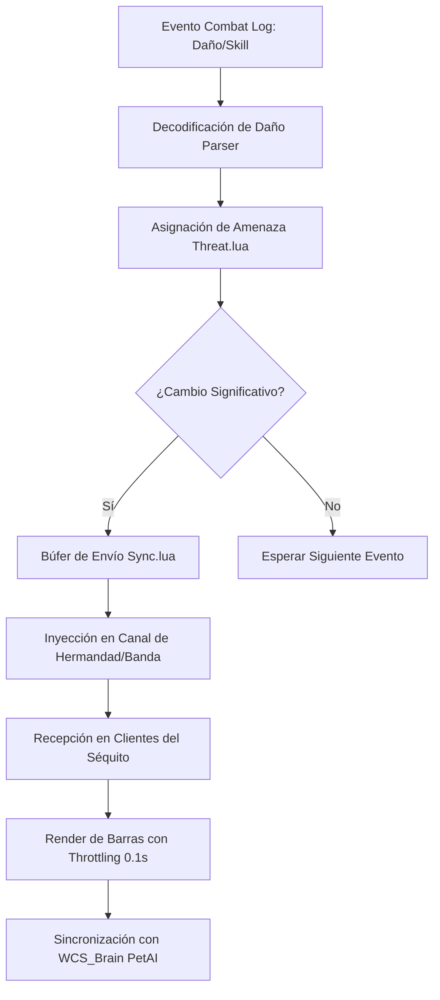

# 📐 Wiki: Arquitectura 'Diamond Tier' — TerrorMeter [v9.4.0]

Estructura técnica del motor de métricas de combate mantenido por **DarckRovert**.

## 🏗️ Jerarquía del Sistema de Métricas (Data Hierarchy)

TerrorMeter opera mediante la interceptación del registro de combate y la orquestación de red:

1.  **Hueso del Parser (`parser-vanilla.lua`)**: Escucha el evento `CHAT_MSG_COMBAT_SELF_LOG` y otros para decodificar daño y sanación.
2.  **Motor de Amenaza (`threat.lua`)**: Calcula dinámicamente los multiplicadores de agro según la clase y hechizo.
3.  **Módulo de Sincronización (`sync.lua`)**: Canal de comunicación bidireccional entre clientes del AddOn en la misma Raid/Guild.
4.  **Interface Renderer (`window.lua`)**: Dibuja las barras de métricas con perfiles de configuración dinámicos.

---

## 🧭 Diagrama de Flujo: Sincronización de Amenaza v9.4

## ⚡ Estrategias de Ingeniería Diamond Tier

- **Selective Parsing**: El parser solo decodifica eventos relevantes para el combate activo, ignorando el spam de buffs/debuffs menores.
- **Sync Throtling**: Los datos de amenaza se envían en paquetes comprimidos cada `50ms` para evitar la saturación del ancho de banda de red del cliente 1.12.1.
- **WCS Neural Integration**: Los informes de eficiencia de mascotas se inyectan a través de eventos personalizados para el análisis táctico.

---
© 2026 **DarckRovert** — El Séquito del Terror.
*Midiendo el camino hacia la gloria en Azeroth.*
